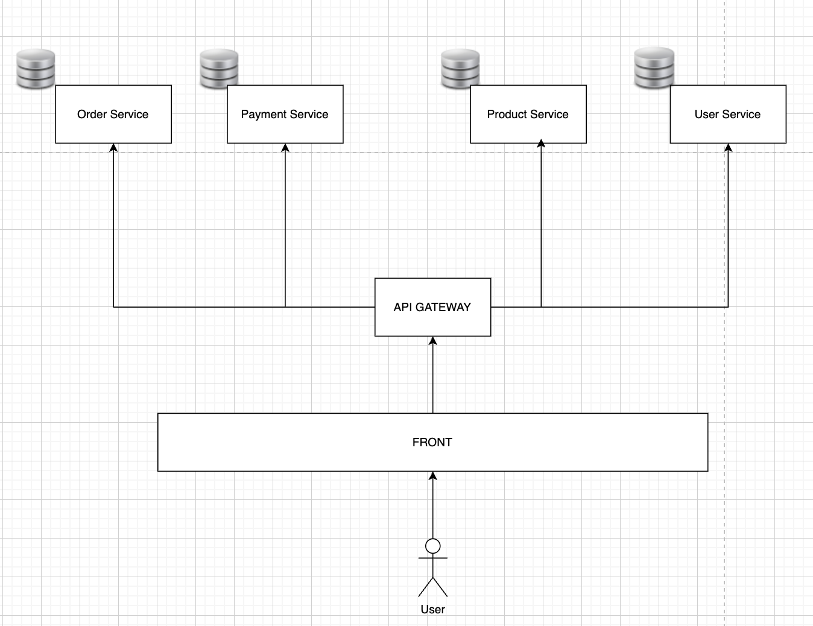

# Introduction aux Microservices

## LES MICROSERVICES

### • De quoi parle-t-on ?
Aujourd’hui, on va parler de microservices, une manière moderne de concevoir des applications.

L’idée est de découper une grosse application en **petites briques autonomes**, spécialisées sur un seul métier.

Chaque brique peut être **développée, testée et déployée indépendamment**.

Et ensemble, elles forment une application complète.

> Comme une entreprise divisée en plusieurs pôles, pour que chacun gère sa partie et que tout soit organisé efficacement.

---

### • Architecture Monolithe vs Microservices

La plupart des développeurs débutent avec une architecture **monolithique**.

C’est une seule application où **tout est centralisé** : front, back, logique métier, base de données.

À l’opposé, les microservices permettent de **séparer chaque fonction** :
- un service pour les utilisateurs,
- un autre pour les commandes,
- un autre pour les produits, etc.

Cela apporte de la **souplesse**, mais aussi **plus de complexité**.

---

### • WebService vs Microservice

Beaucoup de développeurs débutants confondent les deux termes : **WebService** et **Microservice**.
> Pourtant, ce n’est **pas du tout la même chose**.

#### 🔹 Un WebService, c’est :
- Une **interface technique exposée sur le réseau**
- Il permet à un client (navigateur, appli mobile) de **consommer des données ou des fonctionnalités**
- Il peut être REST (JSON, HTTP) ou SOAP (XML)

🧠 **Exemple :**
> Une méthode `GET /produits` qui renvoie une liste de produits depuis une appli **Java EE monolithique**.  
> ➤ C’est un **WebService**… mais **pas un microservice**.

#### 🔹 Un Microservice, c’est :
- Une **mini-application complète**
- Contient sa propre **logique métier**
- Possède sa propre **base de données**
- Expose son propre **WebService REST**
- Est **autonome** : peut être déployé seul, redémarré seul, scalé seul

🧠 **Exemple :**
> Un service `ProduitService` avec Spring Boot :
> - Un contrôleur REST `GET /produits`
> - Une classe métier `ProduitService`
> - Un Repository JPA connecté à sa base PostgreSQL  
> ➤ Là, on parle bien d’un **microservice**.

> ✅ **Tous les microservices utilisent des WebServices, mais tous les WebServices ne sont pas des microservices.**

---

## LES CARACTÉRISTIQUES DES MICROSERVICES

🔹 **Autonome**

Un microservice peut être développé, testé et déployé sans impacter les autres.
🔧 Ex : Le microservice "Paiement" peut être mis à jour indépendamment du microservice "Panier".

🔹 **Responsabilité unique (Single Responsibility)**

Il est centré sur un seul domaine fonctionnel.
🧾 Ex : un service « Facturation », un service « Commandes », un service « Utilisateurs ». Pas un service qui fait tout.

🔹 **Communication via API**

Ils interagissent avec les autres via HTTP (REST) ou via des messages (Kafka, RabbitMQ).

🔄 Ex : le service "Commande" envoie une notification au service "Livraison" quand une commande est confirmée.

🔹 **Déploiement et Scalabilité indépendants**

Chaque microservice peut être répliqué ou scalé indépendamment selon la charge.
📈 Ex : Si le service "Produits" est très sollicité pendant une promo, on peut lancer 3 instances, sans toucher aux autres.

🔹 **Résilience**

Si un service tombe, les autres continuent de fonctionner.
💥 Ex : Si le service "Avis clients" bug, le service "Commande" fonctionne encore normalement.

🔹 **Stockage dédié (souvent)**

Chaque microservice peut avoir sa propre base de données, ce qui évite les conflits.
🛢️ Ex : "Utilisateurs" utilise PostgreSQL, "Paiement" utilise MongoDB.

👉 Cette approche découle du principe "High Cohesion / Loose Coupling" : chaque service est fortement cohérent en interne, mais faiblement couplé aux autres.

---

## ILLUSTRATION SCHÉMATIQUE

Voici maintenant une illustration concrète d’une architecture microservices.  
C’est une vue simplifiée, mais suffisante pour comprendre comment les composants s'articulent.

Tout en haut, on a une **API Gateway**. C’est un peu comme le portier du système :  
elle reçoit les requêtes du client (navigateur, mobile, etc.) et les redirige vers le bon service.

En dessous, on trouve plusieurs microservices, chacun avec une responsabilité métier unique :

🧑 **User Service** – pour gérer les utilisateurs  
🛒 **Order Service** – pour les commandes  
💳 **Payment Service** – pour les paiements  
📦 **Product Service** – pour le catalogue produit

Et chaque microservice peut :
- avoir sa propre base de données
- être développé par une équipe différente
- être scalé indépendamment
- être déployé de manière autonome

L’ensemble fonctionne comme un **système distribué**, où chaque composant parle aux autres via des **API REST ou de la communication asynchrone**.

---

## INCONVÉNIENTS

Mais attention, cette architecture n’est pas magique. Elle introduit aussi une **complexité importante** qu’il faut anticiper et maîtriser.

⚠️ **Inconvénients principaux :**

🧩 **Complexité d’architecture**  
Il faut orchestrer plusieurs services, souvent déployés séparément.

🔌 **Multiplication des appels réseau**  
Chaque interaction entre services devient un appel HTTP → latence, gestion des erreurs.

🔍 **Logs et monitoring répartis**  
On ne peut plus simplement faire un `println` ou regarder une seule console.

🔒 **Sécurité inter-services**  
Il faut authentifier et autoriser chaque appel entre services.

🧪 **Tests end-to-end plus complexes**  
Tester l’ensemble demande de lancer plusieurs services ensemble.

🧠 **Montée en compétence plus difficile**  
Demande plus de rigueur, d’outils, de compréhension globale.

🧠 **Exemple concret :**
> Imaginez que votre `OrderService` appelle `ProductService`, qui appelle `StockService`. Une erreur au milieu peut casser toute la chaîne. Il faut savoir la détecter, la tracer, la gérer.

---

## MICROSERVICES & CLOUD

Avant de comprendre pourquoi les microservices sont parfaitement adaptés au Cloud, il faut déjà comprendre ce qu’on appelle **"le Cloud"**.

☁️ **Le Cloud, c’est quoi ?**

Le Cloud, c’est simplement des **serveurs accessibles à distance**, hébergés dans des **data centers** comme ceux de **Amazon (AWS), Microsoft (Azure), Google (GCP)**, etc.  
Au lieu d’installer vos applications sur un **serveur physique local**, vous les déployez dans un environnement distant, via Internet.

📦 **Trois grandes familles dans le Cloud :**

- **IaaS (Infrastructure as a Service)** :  
  Le fournisseur vous donne des serveurs, et c’est à vous d’y installer vos applis (ex : Amazon EC2).

- **PaaS (Platform as a Service)** :  
  Le fournisseur vous donne une plateforme déjà configurée pour exécuter vos applis (ex : Heroku, App Engine).

- **SaaS (Software as a Service)** :  
  Vous utilisez directement une appli via le web, sans vous soucier des serveurs (ex : Gmail, Dropbox, Office 365).

🔗 **Et le lien avec les microservices ?**

Le Cloud permet de :
- Créer ou supprimer des services à la volée
- Déployer automatiquement grâce à des outils de CI/CD (GitLab CI, Jenkins…)
- Gérer la montée en charge : si un service est surchargé, le Cloud peut lancer d’autres instances automatiquement
- Superviser l’état des services, surveiller les erreurs, les performances, etc.

🧠 **Exemple concret :**
> Imaginez que vous lancez une startup e-commerce. Un jour de promo, votre service “paiement” explose. Grâce au Cloud, vous pouvez faire passer ce service de 2 à 10 instances en quelques secondes, sans racheter de serveurs physiques. Et dès que le trafic redescend, on libère les ressources automatiquement.

Aujourd’hui, dès qu’on développe des microservices, on pense **Cloud**.  
Ils ont été pensés pour fonctionner ensemble : **indépendance, scalabilité, résilience**, tout ça est géré beaucoup plus facilement dans un environnement Cloud.

C’est pour ça que des géants comme **Netflix, Uber, Spotify ou Amazon** ont basé toute leur architecture sur ce duo gagnant : **Microservices + Cloud**.

---